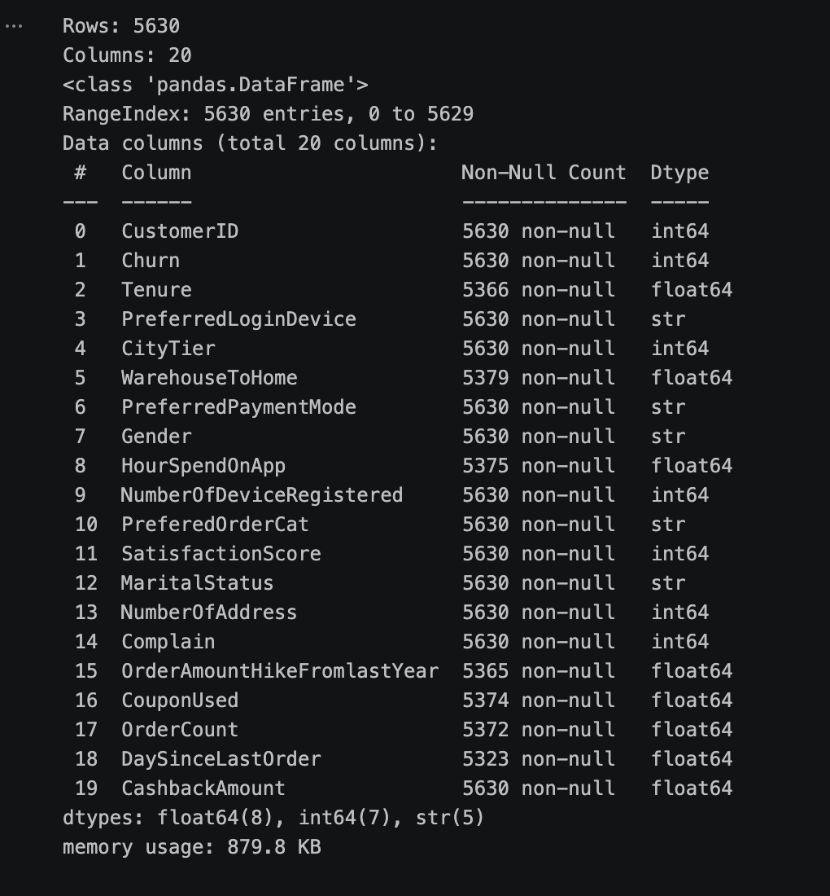
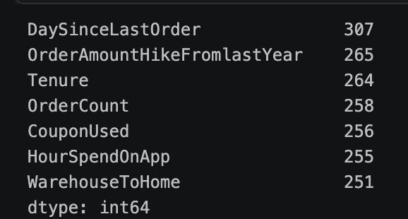
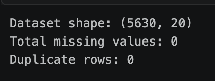
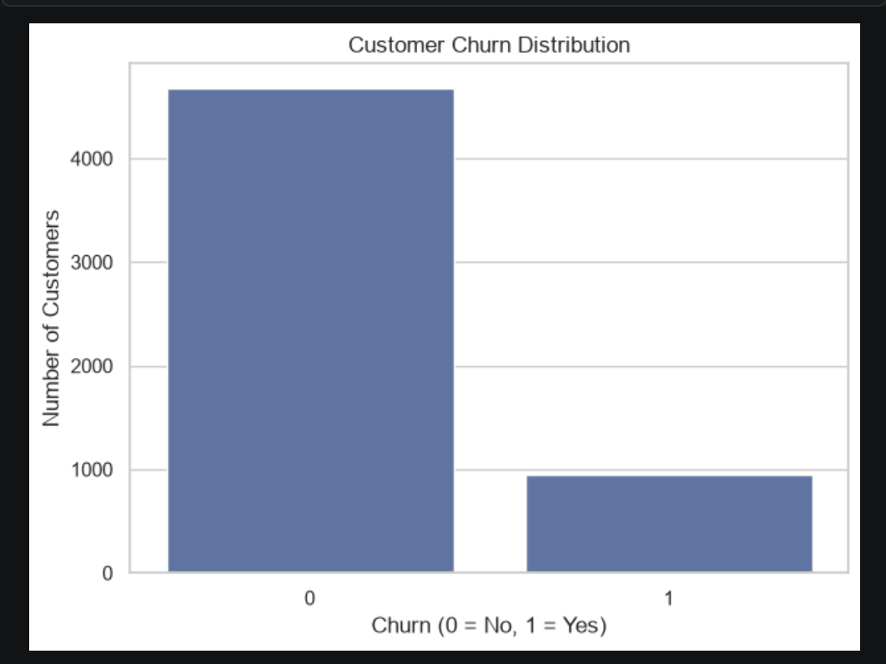
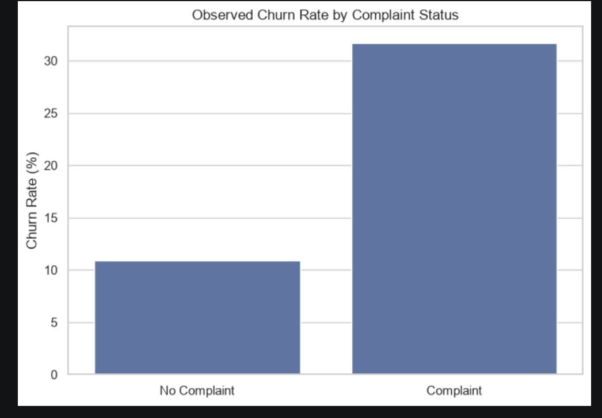
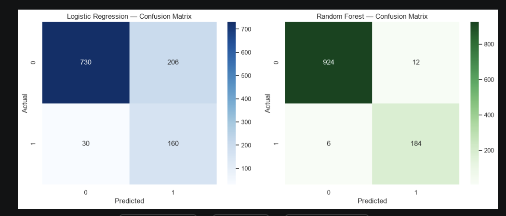
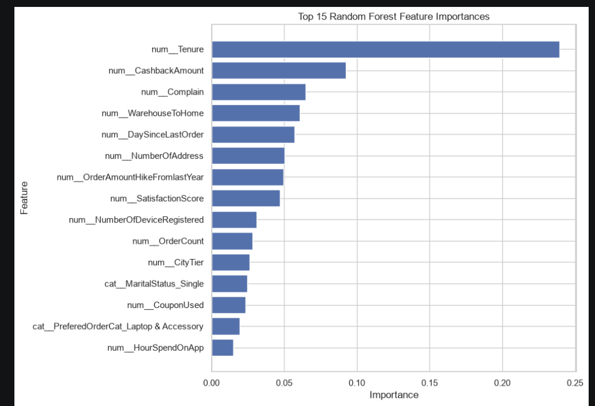

# E-Commerce Customer Churn Analysis & Prediction

## 1. Executive Summary

Customer churn is an important business problem for e-commerce organizations because losing existing customers can affect repeat purchases and long-term customer value.

This project analyzes an e-commerce customer dataset containing 5,630 customer records and develops machine learning models to identify patterns associated with churn.

The project combines data cleaning, exploratory data analysis, business interpretation, and machine learning. Logistic Regression and Random Forest were evaluated using accuracy, precision, recall, F1-score, and ROC-AUC.

On the held-out test set, Random Forest achieved 98.40% accuracy, 93.88% precision, 96.84% recall, 95.34% F1-score, and 0.9986 ROC-AUC.

The analysis also identified tenure, cashback amount, complaint status, warehouse-to-home distance, and days since last order among the more important model features.

## 2. Business Problem

The objective is to understand customer churn patterns and provide data-supported information that can help an e-commerce business identify customers who may require retention attention.

The project follows:

**Data → Information → Insights → Decision → Action**

## 3. Objectives

* Examine the quality and structure of customer data.
* Clean missing and duplicate records.
* Analyze customer churn patterns.
* Identify variables associated with churn.
* Build predictive classification models.
* Compare model performance.
* Identify important predictive features.
* Translate findings into business recommendations.

## 4. Dataset

The project uses the E-Commerce Customer Churn Analysis and Prediction dataset.

Dataset characteristics:

* 5,630 customers
* 20 columns
* Target: `Churn`
* Identifier: `CustomerID`
* Churned customers: 948
* Non-churned customers: 4,682
* Observed churn rate: 16.84%

The workbook also contains a data dictionary describing the variables.

## 5. Data Cleaning

Initial data-quality checks identified missing values in several numerical and categorical columns.

Missing numerical values were filled using the median of the respective column. Missing categorical values were filled using the mode.

Duplicate rows and duplicate customer IDs were checked.

After preprocessing:

* Missing values: **0**
* Duplicate rows: **0**
* Duplicate customer IDs: **0**

`CustomerID` was retained for identification but excluded from machine learning features because it is an identifier rather than a meaningful customer-behavior variable.

## 6. Exploratory Data Analysis

### 6.1 Churn Distribution

The dataset contains 948 churned customers and 4,682 non-churned customers, corresponding to an overall observed churn rate of 16.84%.

### 6.2 Tenure

Average tenure was approximately:

* Non-churned: **11.40**
* Churned: **3.86**

This indicates a substantial difference in tenure between the two groups.

### 6.3 Complaints

Observed churn rate by complaint status:

* No complaint: **10.93%**
* Complaint: **31.67%**

Customers with complaints had a substantially higher observed churn rate in this dataset.

### 6.4 Satisfaction

Observed churn rates by satisfaction score:

* Score 1: **11.51%**
* Score 2: **12.63%**
* Score 3: **17.20%**
* Score 4: **17.13%**
* Score 5: **23.83%**

The pattern is not a simple decreasing relationship. Satisfaction should therefore be interpreted together with other customer and behavioral variables.

### 6.5 Customer Activity

Order count and days since last order were examined to understand customer engagement and recency.

## 7. Machine Learning Methodology

The target variable was `Churn`.

`CustomerID` was excluded from the predictive features.

The data was split into training and testing subsets using an 80/20 stratified split.

Categorical variables were one-hot encoded and numerical variables were standardized for the Logistic Regression pipeline.

Two models were trained:

* Logistic Regression
* Random Forest Classifier

Class balancing was used because the target classes are not evenly distributed.

## 8. Model Evaluation

| Model               | Accuracy | Precision | Recall | F1 Score | ROC-AUC |
| ------------------- | -------: | --------: | -----: | -------: | ------: |
| Logistic Regression |   79.04% |    43.72% | 84.21% |   57.55% |  0.8862 |
| Random Forest       |   98.40% |    93.88% | 96.84% |   95.34% |  0.9986 |

Random Forest produced higher values across the reported metrics on the held-out test data.

Recall and F1-score are particularly useful for evaluating churn identification, while ROC-AUC provides an additional measure of discrimination.

## 9. Feature Importance

The top Random Forest feature importances were:

| Rank | Feature                     | Importance |
| ---: | --------------------------- | ---------: |
|    1 | Tenure                      |     0.2391 |
|    2 | CashbackAmount              |     0.0924 |
|    3 | Complain                    |     0.0648 |
|    4 | WarehouseToHome             |     0.0608 |
|    5 | DaySinceLastOrder           |     0.0570 |
|    6 | NumberOfAddress             |     0.0501 |
|    7 | OrderAmountHikeFromlastYear |     0.0494 |
|    8 | SatisfactionScore           |     0.0473 |
|    9 | NumberOfDeviceRegistered    |     0.0313 |
|   10 | OrderCount                  |     0.0281 |

These values describe model-based predictive importance and should not be interpreted as causal effects.

## 10. Business Insights

### Insight 1 — Newer customers require attention

Tenure was the most important Random Forest feature, and churned customers had substantially lower average tenure.

This suggests that customer retention should include a strong early-customer engagement strategy.

### Insight 2 — Complaints are associated with higher churn

Customers with complaints had a 31.67% observed churn rate compared with 10.93% for customers without complaints.

Complaint resolution can therefore be monitored as an important retention-related business process.

### Insight 3 — Cashback behavior contains predictive information

CashbackAmount was the second-highest Random Forest feature by importance.

The business can investigate whether cashback patterns, reward usage, and customer engagement are related to retention.

### Insight 4 — Delivery/location experience may matter

WarehouseToHome was among the more important predictive variables.

This suggests that delivery-related customer experience may be worth monitoring alongside other churn signals.

### Insight 5 — Recent customer activity is useful

DaySinceLastOrder was also among the more important features.

Customer recency can be included in retention monitoring to identify customers whose engagement patterns may warrant attention.

## 11. Recommendations

* Strengthen onboarding and engagement programs for newer customers.
* Monitor complaints and prioritize timely resolution.
* Monitor order recency and customer activity for potential retention intervention.
* Analyze cashback behavior when designing retention campaigns.
* Investigate delivery experience for customers with larger warehouse-to-home distances.
* Use the predictive model as a decision-support and screening tool rather than treating predictions as certain outcomes.

## 12. Limitations

* The analysis identifies associations and predictive patterns; it does not establish causality.
* Model performance is based on one train/test split.
* Feature importance does not prove that changing a feature will directly change churn.
* The dataset represents the available customer records and may not generalize to every e-commerce business.
* Additional validation and monitoring would be appropriate before using the model in a production decision system.

## 13. Conclusion

This project demonstrates how customer data can be transformed into business-oriented insights and a predictive churn-screening workflow.

The analysis identified tenure, cashback amount, complaints, delivery/location distance, and order recency among important predictive variables.

Random Forest produced substantially stronger test-set metrics than Logistic Regression in this experiment.

The resulting insights can support customer-retention planning by helping a business focus attention on customer groups and behaviors associated with churn.

## 14. Project Screenshots

### 14.1 Dataset Overview

The original dataset contains 5,630 rows and 20 columns.

### 14.2 Missing Value Analysis

The initial dataset contained missing values in several numerical columns.

### 14.3 Data Cleaning Verification

After preprocessing, the dataset contains zero missing values and zero duplicate rows.

### 14.4 Customer Churn Distribution

The chart shows the distribution of customers according to their churn status.

### 14.5 Churn Rate by Complaint Status

Customers with complaints show a higher observed churn rate than customers without complaints.

### 14.6 Model Confusion Matrices

The confusion matrices show the classification results for Logistic Regression and Random Forest.

### 14.7 Random Forest Feature Importance

Tenure is the highest-importance feature in the Random Forest model, followed by CashbackAmount, Complain, WarehouseToHome, and DaySinceLastOrder.

